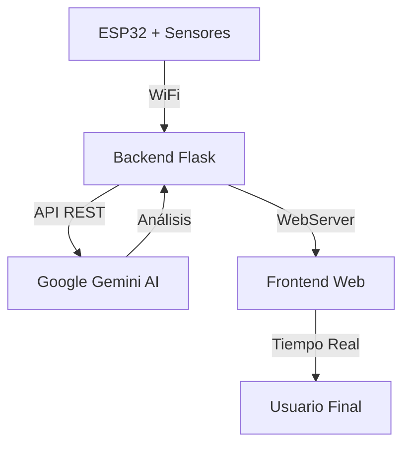

# 🔌 Sistema de Monitoreo Energético Inteligente con ESP32

## 📋 Introducción al Proyecto

Este proyecto implementa un **sistema completo de monitoreo energético** que combina hardware (ESP32), inteligencia artificial (Google Gemini) y una interfaz web moderna. El sistema captura datos de consumo eléctrico en tiempo real, los analiza usando IA y presenta recomendaciones inteligentes a través de una interfaz web intuitiva.

### 🎯 Objetivo Principal
Crear una solución IoT que permita a los usuarios monitorear su consumo eléctrico en tiempo real y recibir análisis inteligentes para optimizar el uso de energía en sus hogares o negocios.

## 👥 Participantes del Proyecto

| Nombre | Rol | Responsabilidades |
|--------|-----|------------------|
| **Carlo Emmanuel** | Desarrollador Full-Stack | Backend Flask, Integración Gemini AI, Frontend Web |
| **[Tu nombre]** | Desarrollador IoT | Hardware ESP32, Sensores, Conectividad WiFi |
| **Equipo CenfoTec** | Colaboradores | Testing, Documentación, Mejoras |

## 🏗️ Arquitectura del Sistema



### 🔄 Flujo de Datos
1. **ESP32** captura mediciones eléctricas (voltaje, corriente, potencia)
2. **Backend Flask** recibe los datos vía HTTP POST
3. **Gemini AI** analiza los datos y genera recomendaciones
4. **Frontend Web** muestra el análisis en tiempo real
5. **Usuario** puede monitorear y tomar decisiones informadas

## 🛠️ Tecnologías Utilizadas

### Hardware
- **ESP32** - Microcontrolador con WiFi integrado
- **Sensores de corriente y voltaje** - Para medición eléctrica
- **Circuitos de acondicionamiento** - Para protección y precisión

### Software Backend
- **Python 3.13** - Lenguaje principal
- **Flask 3.0** - Framework web ligero
- **Google Generative AI** - Análisis inteligente con Gemini
- **python-dotenv** - Gestión de variables de entorno

### Frontend
- **HTML5/CSS3** - Interfaz responsive
- **JavaScript** - Interactividad y comunicación con API
- **Fetch API** - Comunicación asíncrona

### DevOps & Herramientas
- **Git/GitHub** - Control de versiones
- **Arduino IDE** - Desarrollo ESP32
- **VS Code** - Editor de código

## 📁 Estructura del Proyecto

```
CenfoTec-Cedula5/
├── 📱 CodigoESP32.ino          # Código del microcontrolador ESP32
├── 🔧 app.py                   # Backend Flask con integración Gemini
├── 🌐 index.html               # Frontend web responsivo
├── 📦 requirements.txt         # Dependencias Python
├── 🔐 .env.example            # Plantilla de variables de entorno
├── 📖 README.md               # Documentación del proyecto
├── 🚫 .gitignore              # Archivos excluidos del control de versiones
└── 📄 LICENSE                 # Licencia del proyecto
```

## 🚀 Guía de Instalación y Configuración

### 📋 Prerequisitos
- Python 3.8 o superior
- Arduino IDE
- ESP32 DevKit
- Cuenta de Google Cloud (para Gemini AI)

### 🔧 Configuración del Backend

1. **Clonar el repositorio:**
```bash
git clone https://github.com/zMasaro/CenfoTec-Cedula5.git
cd CenfoTec-Cedula5
```

2. **Crear entorno virtual:**
```bash
python -m venv .venv
.\.venv\Scripts\Activate  # Windows
# source .venv/bin/activate  # Linux/Mac
```

3. **Instalar dependencias:**
```bash
pip install -r requirements.txt
```

4. **Configurar variables de entorno:**
```bash
cp .env.example .env
# Editar .env y agregar tu GOOGLE_API_KEY
```

5. **Ejecutar el servidor:**
```bash
python app.py
```

### 📡 Configuración del ESP32

1. **Abrir Arduino IDE**
2. **Cargar `CodigoESP32.ino`**
3. **Configurar WiFi en el código:**
```cpp
const char* WIFI_SSID = "TU_RED_WIFI";
const char* WIFI_PASS = "TU_PASSWORD";
```
4. **Actualizar IP del servidor:**
```cpp
const char* API_URL = "http://TU_IP:5000/datos_esp32";
```
5. **Cargar código al ESP32**

### 🌐 Acceso a la Interfaz Web
- Abrir navegador en: `http://localhost:5000/`
- Para acceso desde otros dispositivos: `http://TU_IP:5000/`

## 💡 Explicación del Código

### 🔌 ESP32 (CodigoESP32.ino)
```cpp
// Conexión WiFi automática con reconexión
void connectWiFi() {
    WiFi.mode(WIFI_STA);
    WiFi.begin(WIFI_SSID, WIFI_PASS);
    // Manejo de errores y timeouts
}

// Construcción de payload JSON con datos de sensores
String buildJson() {
    // Estructura JSON con datos de 2 canales
    // Incluye: voltaje, corriente, potencias, energía
}

// Envío HTTP POST al backend Flask
bool postJSON(const String& payload) {
    // Configuración de headers y autenticación
    // Manejo de respuestas y errores HTTP
}
```

### 🐍 Backend Flask (app.py)
```python
@app.route('/datos_esp32', methods=['POST'])
def recibir_datos_esp32():
    """Recibe datos del ESP32 y los procesa con Gemini AI"""
    datos = request.json
    # Construcción del prompt para Gemini
    # Análisis inteligente de consumo energético
    # Almacenamiento del análisis

@app.route('/get_analisis', methods=['GET'])  
def obtener_analisis():
    """API para obtener el último análisis generado"""
    return jsonify({"analisis": ultimo_analisis})
```

### 🌐 Frontend (index.html)
```javascript
async function actualizarAnalisis() {
    // Fetch asíncrono al backend
    // Manejo de estados de loading
    // Actualización dinámica del DOM
    // Gestión de errores de red
}
```

## 📚 Librerías y Dependencias

### Python (Backend)
- **Flask** `v3.0+` - Framework web minimalista y potente
- **google-generativeai** `v0.3+` - SDK oficial de Google Gemini
- **python-dotenv** `v1.0+` - Gestión segura de variables de entorno

### Arduino (ESP32)
- **WiFi.h** - Conectividad inalámbrica nativa ESP32
- **HTTPClient.h** - Cliente HTTP para comunicación REST

### Frontend
- **Fetch API** - Nativo del navegador, no requiere librerías externas
- **CSS Grid/Flexbox** - Layout responsivo moderno

## 📄 Licencia

```
MIT License

Copyright (c) 2025 CenfoTec-Cedula5 Team

Permission is hereby granted, free of charge, to any person obtaining a copy
of this software and associated documentation files (the "Software"), to deal
in the Software without restriction, including without limitation the rights
to use, copy, modify, merge, publish, distribute, sublicense, and/or sell
copies of the Software, and to permit persons to whom the Software is
furnished to do so, subject to the following conditions:

The above copyright notice and this permission notice shall be included in all
copies or substantial portions of the Software.

THE SOFTWARE IS PROVIDED "AS IS", WITHOUT WARRANTY OF ANY KIND, EXPRESS OR
IMPLIED, INCLUDING BUT NOT LIMITED TO THE WARRANTIES OF MERCHANTABILITY,
FITNESS FOR A PARTICULAR PURPOSE AND NONINFRINGEMENT. IN NO EVENT SHALL THE
AUTHORS OR COPYRIGHT HOLDERS BE LIABLE FOR ANY CLAIM, DAMAGES OR OTHER
LIABILITY, WHETHER IN AN ACTION OF CONTRACT, TORT OR OTHERWISE, ARISING FROM,
OUT OF OR IN CONNECTION WITH THE SOFTWARE OR THE USE OR OTHER DEALINGS IN THE
SOFTWARE.
```

## 🔧 Usos del Sistema

### 🏠 **Hogar Inteligente**
- Monitoreo de consumo por habitaciones
- Detección de electrodomésticos con alta demanda
- Alertas de consumo anómalo
- Recomendaciones de ahorro energético

### 🏢 **Pequeñas Empresas**
- Control de costos energéticos operativos
- Optimización de horarios de operación
- Reporting automático de consumo
- Cumplimiento de normativas energéticas

### 🎓 **Educación**
- Enseñanza de conceptos de IoT
- Prácticas de programación Full-Stack
- Experimentos con IA aplicada
- Proyectos de sostenibilidad

## ⚠️ Problemas Conocidos y Soluciones

### 🔴 **Problema: Pérdida de conexión WiFi del ESP32**
- **Causa:** Señal débil o interferencias
- **Solución:** Implementar reconexión automática cada 30 segundos
- **Código:** Función `connectWiFi()` con timeout y retry logic

### 🔴 **Problema: Sobrecarga de API de Gemini**
- **Causa:** Demasiadas consultas por minuto
- **Solución:** Implementar rate limiting y cache local
- **Mejora futura:** Queue de procesamiento asíncrono

### 🔴 **Problema: Precisión de mediciones eléctricas**
- **Causa:** Ruido en sensores analógicos
- **Solución:** Filtros digitales y calibración periódica
- **Recomendación:** Usar ADC externos de mayor resolución

### 🔴 **Problema: Seguridad de API Keys**
- **Causa:** Exposición accidental de credenciales
- **Solución:** Variables de entorno y .gitignore apropiado
- **Buena práctica:** Rotación periódica de keys

### 🔴 **Problema: Escalabilidad para múltiples dispositivos**
- **Causa:** Arquitectura monolítica actual
- **Solución futura:** Implementar base de datos y microservicios
- **Tecnologías:** PostgreSQL, Docker, Redis para cache

## 🚀 Roadmap de Mejoras

### 📊 **Corto Plazo (1-2 meses)**
- [ ] Base de datos para histórico de mediciones
- [ ] Gráficos interactivos con Chart.js
- [ ] Alertas por email/SMS
- [ ] Modo offline del ESP32

### 🔮 **Mediano Plazo (3-6 meses)**
- [ ] App móvil React Native
- [ ] Dashboard administrativo
- [ ] API REST completa con autenticación
- [ ] Integración con otros sensores (temperatura, humedad)

### 🌟 **Largo Plazo (6+ meses)**
- [ ] Machine Learning para predicción de consumo
- [ ] Integración con smart grid
- [ ] Certificación para uso comercial
- [ ] Marketplace de plugins

## 🤝 Contribuciones

¡Las contribuciones son bienvenidas! Por favor:

1. Fork del repositorio
2. Crear rama feature (`git checkout -b feature/mejora`)
3. Commit con mensajes descriptivos
4. Push a la rama (`git push origin feature/mejora`)
5. Abrir Pull Request

### 📧 Contacto
- **GitHub:** [@zMasaro](https://github.com/zMasaro)
- **Email:** proyecto.cenfotec@gmail.com
- **Universidad:** CenfoTec

---

<div align="center">

**⭐ Si este proyecto te fue útil, no olvides darle una estrella ⭐**

[](https://github.com/zMasaro/CenfoTec-Cedula5)
[](https://github.com/zMasaro/CenfoTec-Cedula5/fork)

</div>
